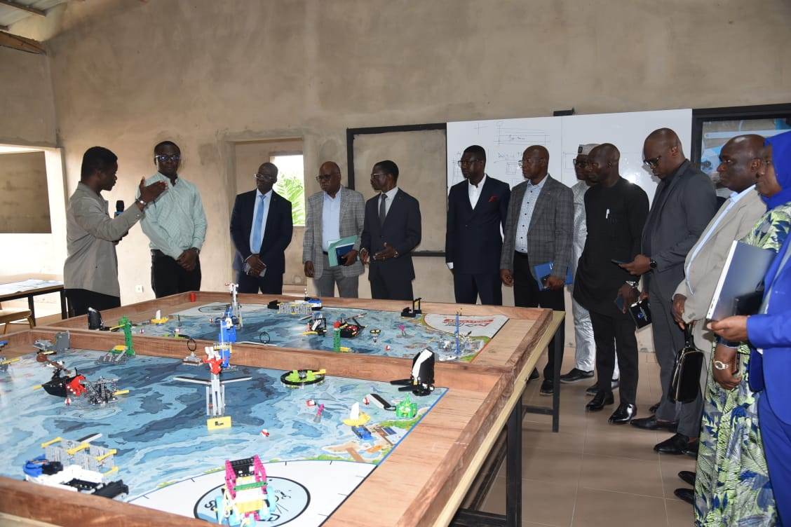

# Journal — lundi 24 août 2026 (rédigé par : Essozolim LEMOU)

## Fait aujourd'hui

* Lancement officiel de la formation des FabManagers par le Ministre de l’Éducation nationale. La formation est prévue sur **1 mois**, du **24 août au 24 septembre 2026**.
* Participation à la cérémonie officielle et réalisation d’une **photo de famille** 

* Visite du Ministre 
A la suite de ces mots, le ministre à visiter les ateliers de formation 
 
 Une photo de famille a ensuite été réalisée avec les différents participants, formateurs et responsables présents à la cérémonie.

### Début des activités
* Début des activités de formation avec les formateurs après le lancement officiel.
* Chant de l’hymne national avant le début des travaux.
* Mise à disposition d’ordinateurs pour les participants ne disposant pas de leur propre machine.
* Installation de **Git** et de **Visual Studio Code (VS Code)** sur les ordinateurs des participants.

## Appris

* La formation des FabManagers se déroule sur une période d’**un mois**, du 24 août au 24 septembre 2026. 
 - **Formation sur Makdown**
* Git est un outil de **gestion de versions** qui sera utilisé dans le cadre des activités de formation.
* Visual Studio Code est un **éditeur de code** qui servira d’environnement de travail pour les activités techniques.
* Le premier module de la formation a été amorcé avec l’installation et la préparation des outils de travail.

## Raté, puis corrigé

* Aucun incident technique majeur signalé au cours de cette première journée.
* Les participants qui ne disposaient pas d’ordinateur ont reçu une machine afin de pouvoir participer aux activités pratiques.

## Décidé

* Utiliser **Git** et **Visual Studio Code** comme premiers outils de travail → préparation du premier module de formation.
* Mettre à disposition un ordinateur aux participants qui n’en disposent pas → tous les participants peuvent prendre part aux act ivités pratiques.

## À faire demain

* Poursuivre le premier module de formation — **Komlan Giovani KAMEKPO**
* Approfondir l’utilisation de Git et de Visual Studio Code — **Komlan Giovani KAMEKPO**
* Poursuivre les activités pratiques prévues par les formateurs — **Komlan Giovani KAMEKPO**
