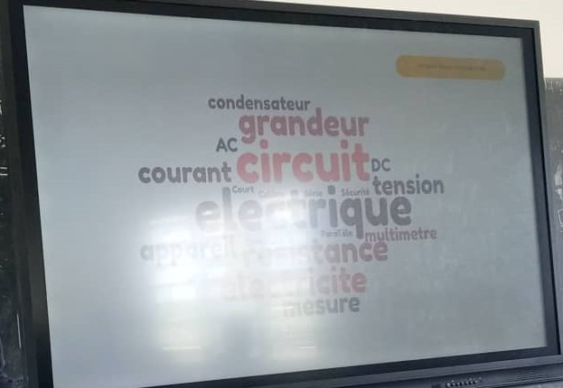
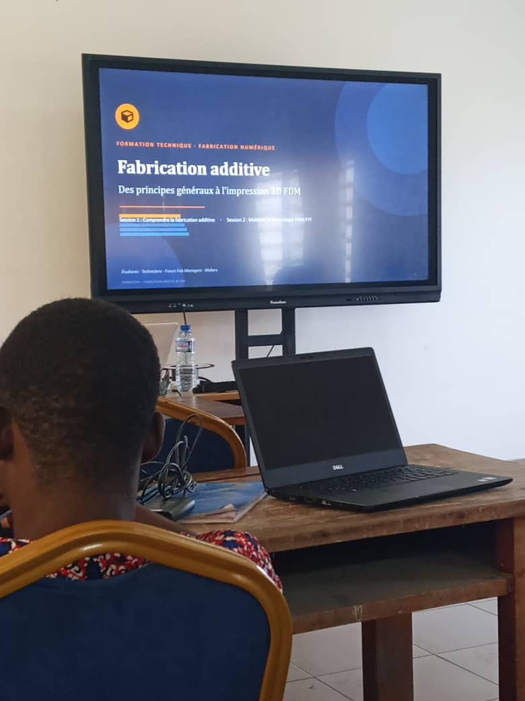

# Journal — mercredi 26 août 2026 (rédigé par : Essozolim LEMOU)

## Fait aujourd'hui

* Formation des groupes pour les activités des **23 et 24 août**.

* Début des **ateliers pratiques** autour de plusieurs technologies de fabrication numérique.

* **Atelier 1 — Découpe laser**, présenté par le formateur :

  * Découverte de plusieurs machines : **MetalFab**, **M1 Ultra à technologie diode**, **F2 à technologie diode** et **P3 utilisant la technologie CO₂**.
  * Introduction au principe général du **laser** et à son utilisation dans la fabrication numérique.
  * Découverte de l’**anatomie d’une découpeuse laser** et de ses principaux éléments.
  * Présentation des grandes familles de lasers industriels : **CO₂, fibre, diode et UV**.
  * Découverte du logiciel **xTool Studio** utilisé pour préparer et piloter certains travaux de découpe.
  * Comparaison des différentes technologies de laser selon leurs caractéristiques, notamment la précision et la qualité de coupe.
  * Présentation des éléments de **sécurité laser** selon la classification **IEC 60825-1**, allant de la classe 1 à la classe 4.
  * Échanges sur les critères permettant de **choisir une machine laser** adaptée à un besoin donné.

* **Atelier 2 — Bases de l’électronique dans les FabLabs**, présenté par  :

  * Introduction aux principales grandeurs électriques.
  * Découverte de la **tension électrique**, qui représente une différence de potentiel.
  * Découverte du **courant électrique**, correspondant au déplacement des charges électriques.
  * Découverte de la **résistance électrique**, qui s’oppose au passage du courant.
  * Présentation de la **plaque d’essais (breadboard)** comme outil permettant de réaliser des montages électroniques sans soudure.

* **Atelier 3 — Fabrication additive**, présenté par **l’ingénieur LOLO** :

  * Introduction aux technologies d’impression 3D et à leur fonctionnement suivant les mouvements sur les axes **X, Y et Z**.
  * Présentation de la technologie **FDM/FFF** et de son principe de dépôt de matière fondue.
  * Présentation de la technologie **SLA**, basée sur la photopolymérisation de résine.
  * Présentation de différentes technologies et architectures d’imprimantes 3D.
  * Découverte de matériaux utilisés en impression 3D, notamment **PLA, ASA, ABS, PP et PVA**.
  * Présentation du **PVA (alcool polyvinylique)** comme matériau pouvant être dissous dans l’eau et utilisé notamment pour certains supports.
  * Présentation de **Fusion 360 d’Autodesk** pour la conception des pièces.
  * Découverte des logiciels de **slicing**, notamment **Bambu Studio**.
  * Présentation du **warping**, problème pouvant apparaître lorsque les premières couches d’une pièce se décollent ou se déforment sous l’effet des contraintes thermiques.
  * Présentation du rôle du **chauffage du plateau** et de l’utilisation de surfaces d’adhésion telles que le **PEI**.
  * Importance de l’**orientation de la pièce** avant l’impression.
  * Découverte des paramètres nécessaires à la génération et à l’utilisation des **supports d’impression**.
  * Présentation de sites permettant de rechercher et télécharger des **modèles 3D imprimables**.
  * Présentation de l’historique et de l’évolution de l’**impression 3D**.
  * Présentation des grandes familles de technologies, notamment **FDM/FFF, SLA et SLS**.
  * Comparaison des technologies d’impression 3D et de leurs domaines d’utilisation.
  * Approfondissement du fonctionnement de la technologie **FDM**.

* **Atelier 4 — Brainstorming et réflexion sur les projets** :

  * Réflexion sur l’utilisation de **microcontrôleurs ESP32**, notamment des cartes ESP32 équipées de caméra.
  * Discussion sur la nécessité d’obtenir un **résultat concret et fonctionnel** à la sortie des projets.
  * Début de réflexion sur les possibilités d’intégration de l’électronique, de la programmation et de la fabrication numérique dans les projets.

## Appris

* Les principales familles de lasers utilisées dans la fabrication industrielle et numérique sont notamment les lasers **CO₂, fibre, diode et UV**.

* Le choix d’une machine laser dépend du matériau à travailler, de la précision recherchée, de la puissance nécessaire, de la vitesse de travail et du type d’application.

* La sécurité des équipements laser est classée selon les **classes IEC 60825-1**, de la classe 1 à la classe 4.

* Une découpeuse laser possède plusieurs éléments qui doivent être compris avant son utilisation afin de travailler efficacement et en sécurité.

* Les trois grandeurs électriques fondamentales étudiées sont la **tension, le courant et la résistance**.

* Une **breadboard** permet de réaliser rapidement des circuits électroniques sans effectuer de soudure.

* L’impression 3D utilise différents systèmes de déplacement suivant les axes **X, Y et Z**.

* La technologie **FDM/FFF** consiste à déposer successivement de la matière fondue afin de construire une pièce couche par couche.

* La technologie **SLA** utilise une résine photosensible solidifiée par exposition à une source lumineuse.

* Le **PVA** peut être utilisé comme matériau de support car il est soluble dans l’eau.

* L’orientation de la pièce, le réglage du plateau, la température et les paramètres de support influencent fortement la qualité d’une impression 3D.

* Le **warping** peut être lié aux contraintes thermiques et à une mauvaise adhérence de la pièce au plateau ; le chauffage du plateau et l’utilisation d’une surface adaptée, comme le **PEI**, peuvent contribuer à résoudre ce problème.

* Les logiciels de conception et de préparation d’impression constituent une partie essentielle du processus de fabrication additive.

* Les projets de la formation devront aboutir à des **réalisations concrètes et fonctionnelles**, et pourront intégrer des microcontrôleurs tels que l’**ESP32**.

## Raté, puis corrigé

* La formation a permis d’identifier le **warping** comme un problème pouvant affecter l’adhérence et la qualité des impressions 3D → analyse du rôle du chauffage du plateau et des surfaces d’adhésion → utilisation de solutions adaptées, notamment le **PEI** et un réglage approprié des paramètres d’impression.

* Les différentes technologies de fabrication ne répondent pas toutes aux mêmes besoins → comparaison des technologies **CO₂, fibre, diode et UV** pour le laser ainsi que **FDM/FFF, SLA et SLS** pour la fabrication additive → meilleure compréhension du choix de la technologie en fonction du matériau, de la précision et de l’application.

## Décidé

* Approfondir la maîtrise des différentes technologies de **fabrication numérique** présentées au cours des ateliers.

* Tenir compte des **contraintes et limites propres à chaque machine** avant de choisir une technologie de fabrication.

* Intégrer, lorsque cela est pertinent, des solutions électroniques et programmables dans les projets, notamment à l’aide de **microcontrôleurs ESP32**.

* Veiller à ce que les projets réalisés dans le cadre de la formation aboutissent à un **résultat concret, fonctionnel et démontrable**.

## À faire demain

* Poursuivre les ateliers pratiques de la formation 

* Approfondir les technologies de fabrication numérique présentées 

* Poursuivre la réflexion et le brainstorming autour des projets à réaliser — 
