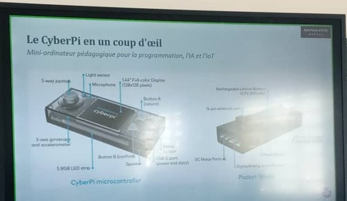
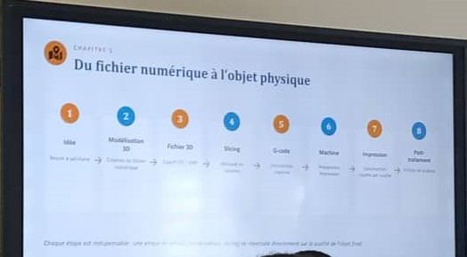

# Journal — jeudi 27 août 2026 (rédigé par : Essozolim LEMOU)

## Fait aujourd'hui

* Poursuite des ateliers pratiques de la formation des FabManagers.

### Atelier 1 — Découpe laser

Approfondissement de la maîtrise du logiciel **xTool Studio** et des paramètres nécessaires à la réalisation d’une découpe ou d’une gravure laser.

* Étude des trois principaux paramètres de travail du laser :

  * **Puissance du laser** ;
  * **Vitesse de déplacement de la tête laser** ;
  * **Nombre de passes** de la tête laser.

* Pour une **découpe**, utilisation d’une puissance élevée et d’une vitesse plus lente. Exemple étudié : **puissance 90 % et vitesse 50**.

* Pour une **gravure**, utilisation d’une puissance plus faible et d’une vitesse plus élevée. Exemple étudié : **puissance 20 % et vitesse 600**.

* Pour une **gravure de contour**, utilisation d’une puissance faible et d’une vitesse élevée. Exemple étudié : **puissance 20 % et vitesse 400**.

* Réalisation d’une **carte de visite** destinée à être fabriquée par gravure laser.

* Gravure de la carte de visite sur une plaque de **contreplaqué de 3 mm d’épaisseur**.

### Atelier 2 — Bases de l’électronique dans les FabLabs

Atelier présenté par **Wisdom**, consacré au **CyberPi** et à l’écosystème **mBuild**.

* Découverte du **CyberPi** et de l’écosystème mBuild.
* Étude des notions d’**entrée** et de **sortie** dans un système électronique.
* Installation de la version **V5.6** avec les kits **mBlock**.
* Découverte de la **Pocket Shield**.
* Réalisation d’un projet pratique : **veilleuse automatique**.

### Atelier 3 — Fabrication additive

Atelier présenté par **l’ingénieur LOLO**, consacré à la préparation et au lancement d’une impression 3D.

* Installation des logiciels de **slicing** :

  * **Bambu Studio** ;
  * **PrusaSlicer**.
* Initiation au réglage de **Bambu Studio** pour préparer un fichier destiné à l’impression 3D.
* Réalisation d’une première impression du projet **Cube016Profile**.
* Identification des premiers réglages nécessaires avant de lancer une impression 3D.

### Atelier 4 — Brainstorming et réflexion sur les projets

* Installation du logiciel **Fusion 360** pour la conception et la modélisation 3D.
* Préparation des outils nécessaires aux prochaines étapes de conception des projets.

## Appris

* Les paramètres de **puissance, vitesse et nombre de passes** jouent un rôle essentiel dans la qualité d’une découpe ou d’une gravure laser.

* Pour une découpe laser, une **puissance plus élevée** et une **vitesse plus faible** permettent généralement de fournir davantage d’énergie au matériau.

* Pour une gravure, une **puissance plus faible** associée à une **vitesse plus élevée** permet de marquer la surface sans nécessairement traverser le matériau.

* Les paramètres doivent être adaptés au **matériau, à son épaisseur et au résultat recherché**. Les valeurs étudiées aujourd’hui constituent donc des paramètres de travail à tester et à ajuster selon la machine et le matériau.

* Le logiciel **xTool Studio** permet de préparer les travaux destinés aux machines xTool.

* Le **CyberPi** et l’écosystème **mBuild** permettent de réaliser des systèmes électroniques intégrant des entrées, des sorties et différents modules.

* Une **entrée** permet au système de recevoir une information, tandis qu’une **sortie** permet au système de produire une action ou un résultat.

* Un **slicer** transforme un modèle 3D en instructions permettant à l’imprimante 3D de fabriquer la pièce couche par couche.

* **Bambu Studio** et **PrusaSlicer** sont deux logiciels permettant de préparer les fichiers pour l’impression 3D.

* Avant de lancer une impression 3D, plusieurs paramètres doivent être vérifiés afin d’obtenir une impression correcte.

* **Fusion 360** permet de réaliser la conception et la modélisation des objets qui pourront ensuite être fabriqués par différentes technologies.

## Raté, puis corrigé

* Les paramètres d’un laser ne peuvent pas être choisis indépendamment du résultat recherché → comparaison des réglages pour la découpe, la gravure et la gravure de contour → utilisation de paramètres différents selon l’opération à réaliser.

* Le lancement d’une impression 3D nécessite plusieurs réglages préalables → découverte des principaux paramètres dans **Bambu Studio** → préparation et lancement de l’impression du projet **Cube016Profile**.

* La réalisation de projets nécessitant une conception 3D demande un outil adapté → installation de **Fusion 360** → préparation de l’environnement de conception pour les prochaines activités.

## Décidé

* Continuer à pratiquer **xTool Studio** afin de mieux maîtriser les paramètres de découpe et de gravure laser.

* Toujours adapter la **puissance, la vitesse et le nombre de passes** au matériau et au résultat recherché avant de lancer une fabrication.

* Poursuivre l’apprentissage de **Bambu Studio** et de **PrusaSlicer** pour améliorer la préparation des impressions 3D.

* Utiliser **Fusion 360** pour les prochaines activités de conception et de modélisation 3D.

* Poursuivre les exercices pratiques afin de transformer progressivement les connaissances acquises en réalisations concrètes.

## À faire demain

* Poursuivre les exercices pratiques de découpe et de gravure laser 

* Approfondir les réglages de Bambu Studio pour l’impression 3D 

* Poursuivre la prise en main de Fusion 360 

* Continuer les exercices d’électronique avec le CyberPi et mBuild 