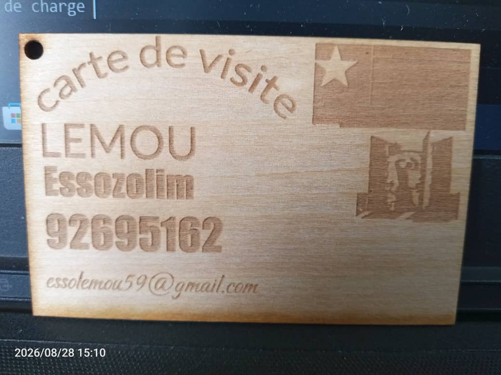
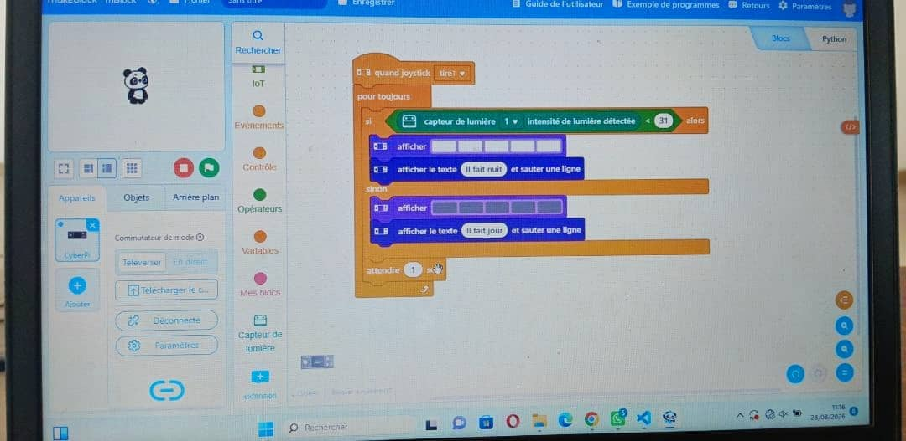

# Journal — vendredi 28 août 2026 (rédigé par : Essozolim LEMOU)

## Fait aujourd'hui

* Poursuite des **ateliers pratiques** de la formation des FabManagers.

### Atelier 1 — Découpe laser

* Poursuite des travaux de **découpe et de gravure laser** à partir des projets réalisés précédemment.
* Utilisation du logiciel **xTool Studio** pour préparer les fichiers destinés à la découpe et à la gravure.
* Réalisation des travaux à l’aide d’une **machine laser à technologie CO₂**.
* Mise en pratique des notions abordées lors des précédentes séances concernant la préparation et l’exécution d’un travail de fabrication numérique.

### Atelier 2 — Bases de l’électronique dans les FabLabs

* Atelier présenté par **Wisdom**, consacré au **CyberPi** et à l’écosystème **mBuild**.
* Découverte et prise en main des éléments de l’environnement CyberPi/mBuild.
* Réalisation d’un projet pratique : **veilleuse automatique**.

* Mise en application des notions de base de l’électronique et de la programmation à travers la réalisation du projet.

### Atelier 3 — Fabrication additive

* Atelier présenté par **l’ingénieur LOLO**, consacré à la préparation et au lancement d’une **impression 3D**.
* Identification des premiers réglages nécessaires avant le lancement d’une impression.
* Poursuite de la découverte des paramètres permettant d’obtenir une impression de qualité.
* Suite de l'installation et de la prise en main du logiciel **Fusion 360** pour la conception et la modélisation 3D.

### Atelier 4 — Design Thinking et méthode spirale

* Atelier présenté par **l’ingénieur OLANLO**

* Introduction au **Design Thinking**, présenté comme une méthode de conception centrée sur l’utilisateur.

* Compréhension du principe consistant à **ouvrir largement les possibilités avant de trancher**.

* Importance d’appuyer la conception sur des informations et des observations documentées plutôt que sur de simples suppositions.

* Étude des **cinq étapes clés du Design Thinking** :

  1. **Empathie :** recueillir les besoins et les informations auprès des utilisateurs plutôt que de les imaginer.
  2. **Définir :** formuler clairement le problème à résoudre en une phrase précise.
  3. **Idéer :** produire largement des idées, puis effectuer une sélection explicite.
  4. **Prototyper :** représenter concrètement une idée. Le premier prototype peut prendre différentes formes :

     * croquis coté ;
     * représentation de l’idée ;
     * scénario d’usage ;
     * maquette.

     La fabrication physique intervient après cette phase de représentation.
  5. **Tester :** présenter le prototype à l’utilisateur, observer son comportement et recueillir ses retours en restant attentif aux réactions et aux besoins exprimés.

* Présentation des **quatre pièges observés dans la conduite d’un projet** et réflexion sur les moyens de les éviter.

* Présentation de la **méthode spirale** et de son caractère itératif.

* Compréhension du fait qu’un projet ne suit pas nécessairement un processus linéaire : il peut revenir à une étape précédente à partir des résultats obtenus lors des tests.

* Application du principe des **boucles successives d’amélioration** aux projets de la formation.

### Cahier des charges

* Introduction au **cahier des charges** comme document permettant de préciser le besoin, les objectifs, les contraintes et les résultats attendus d’un projet.
* Mise en relation du cahier des charges avec la démarche de conception et le Design Thinking.

## Appris

* **xTool Studio** permet de préparer les travaux de découpe et de gravure destinés aux machines laser compatibles.
* Une machine laser **CO₂** peut être utilisée pour réaliser aussi bien des opérations de découpe que de gravure, selon le matériau et les paramètres choisis.
* Le **CyberPi** et l’écosystème **mBuild** permettent de réaliser des projets électroniques et interactifs.
* Une veilleuse automatique constitue une application pratique permettant de mettre en œuvre les notions d’électronique et de programmation.
* Avant une impression 3D, plusieurs paramètres doivent être vérifiés et réglés afin d’obtenir un résultat satisfaisant.
* **Fusion 360** permet de concevoir et de modéliser des objets en 3D avant leur fabrication.
* Le **Design Thinking** est une démarche de conception centrée sur l’utilisateur.
* Les cinq grandes étapes étudiées sont : **Empathie → Définir → Idéer → Prototyper → Tester**.
* L’étape d’empathie consiste à **recueillir des informations auprès de l’utilisateur plutôt que de supposer ses besoins**.
* Le prototype ne correspond pas nécessairement immédiatement à l’objet final : il peut commencer par un **croquis, une représentation ou un scénario d’usage**.
* Le Design Thinking est un **processus itératif** : les résultats des tests peuvent conduire à reformuler le problème, modifier l’idée ou réaliser un nouveau prototype.
* La **méthode spirale** permet ainsi d’améliorer progressivement une solution grâce à plusieurs cycles de conception, de prototypage et de test.
* Le **cahier des charges** constitue un outil important pour cadrer un projet et préciser les attentes avant sa réalisation.

## Raté, puis corrigé

* Lors des activités de fabrication, la préparation du fichier et le réglage des paramètres sont essentiels pour obtenir le résultat souhaité → vérification du fichier et des paramètres avant la découpe et la gravure → réalisation des travaux avec la machine laser CO₂.

* En conception, le risque est de proposer directement une solution sans avoir suffisamment compris le besoin de l’utilisateur → introduction du **Design Thinking** et de la phase d’empathie → prise en compte des besoins réels avant de définir et de concevoir la solution.

* Le processus de conception peut nécessiter plusieurs modifications → utilisation de la **méthode spirale** et des tests successifs → amélioration progressive du projet à partir des observations et des retours obtenus.

## Décidé

* Poursuivre la pratique de la **découpe et de la gravure laser** afin de mieux maîtriser la préparation des fichiers et les paramètres de fabrication.

* Continuer la prise en main du **CyberPi et de l’écosystème mBuild** à travers des projets pratiques.

* Utiliser une démarche centrée sur l’utilisateur pour les projets de la formation, en passant par les étapes **empathie, définition, idéation, prototypage et test**.

* Privilégier une démarche **itérative** : tester une solution, observer les résultats, identifier les problèmes et améliorer progressivement le prototype.

* Utiliser le **cahier des charges** pour mieux définir les besoins, les contraintes et les objectifs des projets.

## À faire demain

* Poursuivre les exercices pratiques de **découpe et de gravure laser** 

* Approfondir les réglages de **Bambu Studio** pour l’impression 3D 

* Poursuivre la prise en main de **Fusion 360** pour la conception et la modélisation 3D 

* Continuer les exercices d’électronique avec le **CyberPi et mBuild** 

* Poursuivre la réflexion sur les projets à partir du **Design Thinking et du cahier des charges** 
