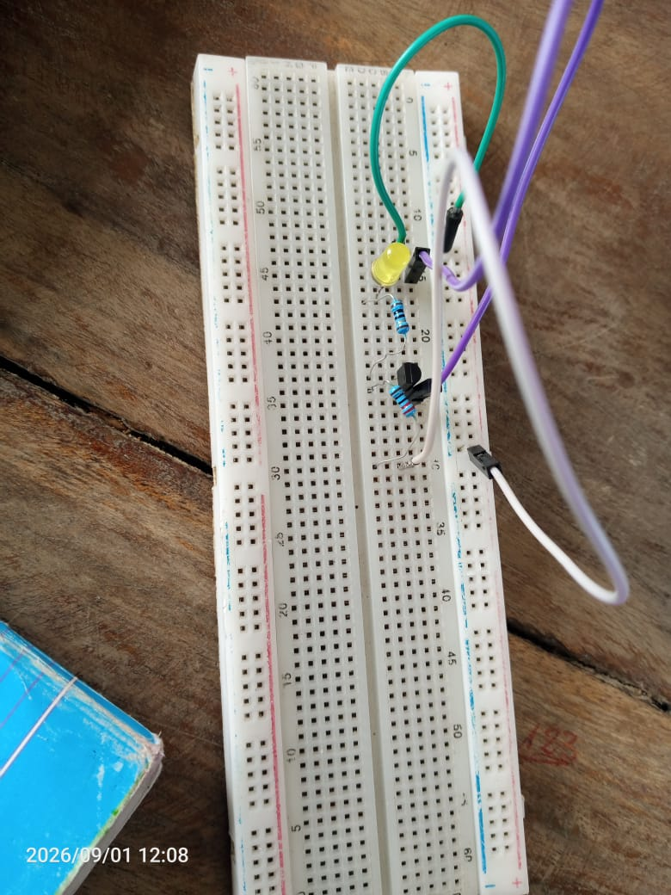
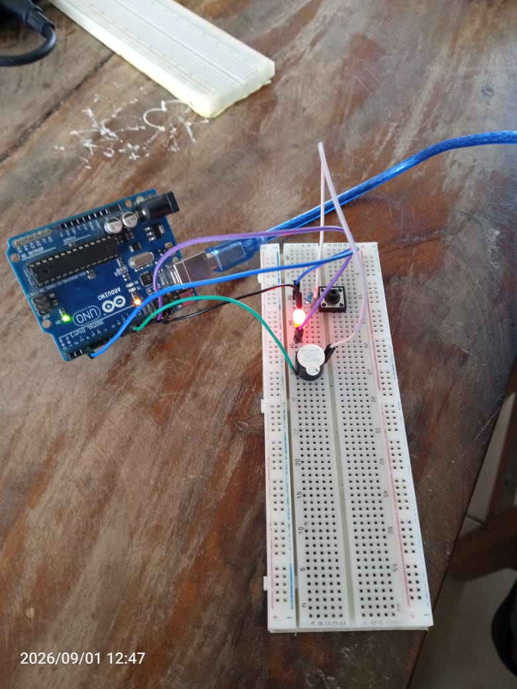

# Journal — mardi 01 septembre 2026 (rédigé par : Essozolim LEMOU)

## Fait aujourd'hui

### 1. Impression DTF avec xTool

* Découverte de la technique d’**impression DTF (Direct to Film)** avec les équipements **xTool**.

* Présentation de la méthode permettant de réaliser des motifs destinés notamment aux **textiles et au nylon**.

* Identification du matériel nécessaire à la réalisation d’une impression DTF :

  * une **imprimante DTF** ;
  * un **film DTF** ;
  * des **encres DTF** : cyan (C), magenta (M), jaune (J), noir (N) et blanc ;
  * une **poudre adhésive** ;
  * un système de **thermofusion / presse à chaud** pour assurer le transfert du motif.

* Étude des principales étapes du procédé DTF :

  1. **Concevoir** le motif ;
  2. **Imprimer** le motif sur le film DTF ;
  3. **Poudrer** le film avec la poudre adhésive ;
  4. **Cuire** afin de faire fondre et fixer la poudre ;
  5. **Presser** le motif sur le support à l’aide d’une presse à chaud ;
  6. **Retirer le film** après le transfert.

* Présentation des principaux **paramètres d’impression**, ainsi que de leur influence sur la qualité du transfert.

* Présentation des **avantages du DTF**, notamment la possibilité de transférer des motifs détaillés sur différents supports textiles.

* Sensibilisation aux règles de **sécurité et de contrôle de la qualité** pendant les différentes étapes du procédé.

* Point essentiel retenu : **le motif ne doit jamais être déposé directement sur le vêtement. Il est d’abord imprimé sur un film DTF, puis transféré sur le textile à l’aide d’une presse à chaud.**
> ** Ne jamains déposé le moditif directement sur le vêtement. Elle imprime d'abord sur un film ; le transfert final se fait uniquement avec la presse à chaud**

### 2. Atelier électronique

* Poursuite de l’apprentissage des **bases de l’électronique** à travers des montages pratiques.

* Prise en main de la **breadboard SK10** et compréhension de la manière dont les différents trous sont reliés électriquement à l’intérieur de la plaque.

* Réalisation de plusieurs premiers circuits électroniques :

  * **Circuit 1 :** une résistance, une LED et un générateur sur la breadboard SK10.
  * **Circuit 2 :** deux résistances, deux LED et un générateur.
  
  * **Circuit 3 :** deux résistances, un transistor et un générateur.

* Étude d’un **schéma fonctionnel** comprenant :

  * un bouton-poussoir ;
  * une LED ;
  * un buzzer ;
  * une carte Arduino.

* Ces exercices ont permis de mettre en pratique les notions de connexion des composants et de fonctionnement élémentaire d’un circuit électronique.

### 3. Suite de l’initiation à Fusion 360

* Poursuite de la formation sur **Fusion 360**.

* Réalisation d’un **cylindre** à partir des fonctions de **révolution** et d’**extrusion**.

* Mise en pratique des outils de modélisation 3D à partir d’un **dessin technique**.

* Réalisation d’une première pièce en suivant les dimensions et indications fournies sur le dessin technique.

## Appris

* Le **DTF (Direct to Film)** est une technique de transfert qui consiste à imprimer un motif sur un film avant de le transférer sur le support à l’aide de la chaleur et de la pression.

* Le procédé DTF suit plusieurs étapes successives : **conception → impression → poudrage → cuisson → pressage → retrait du film**.

* Les encres utilisées en DTF comprennent les couleurs **C, M, J, N ainsi que le blanc**.

* La poudre adhésive joue un rôle important dans la fixation du motif lors du transfert thermique.

* Le transfert final du motif est réalisé à l’aide d'une **presse à chaud**.

* Une **breadboard SK10** permet de réaliser des circuits électroniques sans soudure et possède des connexions internes entre certains groupes de trous.

* Une résistance, une LED, un transistor, un bouton-poussoir et un buzzer peuvent être intégrés dans différents types de circuits électroniques.

* Un **transistor** peut être utilisé comme élément de commande dans un circuit électronique.

* Un schéma fonctionnel permet de représenter les différents éléments d’un système et leurs relations fonctionnelles.

* Dans **Fusion 360**, les fonctions d’**extrusion** et de **révolution** permettent de créer des formes 3D à partir de géométries de base.

* Un dessin technique constitue une référence importante pour reproduire une pièce avec les dimensions et la géométrie demandées.

## Raté, puis corrigé

* La breadboard SK10 nécessite de bien comprendre les connexions internes avant de réaliser un montage ; étude de la disposition et des liaisons entre les trous ; réalisation progressive de circuits simples afin de vérifier les connexions.

* La réalisation de plusieurs circuits électroniques nécessite de respecter l’ordre et le branchement correct des composants ; réalisation successive de circuits avec **1 résistance/1 LED**, puis **2 résistances/2 LED**, puis un montage avec **transistor** ; meilleure compréhension pratique des connexions entre les composants.

* La modélisation d’une pièce à partir d’un dessin technique nécessite de respecter les dimensions et la géométrie indiquées ; utilisation des fonctions de modélisation de Fusion 360, notamment **extrusion** et **révolution** ; réalisation d’une première pièce à partir du dessin technique.

## Décidé

* Respecter les différentes étapes du procédé **DTF** afin d’obtenir un transfert de qualité et sécurisé.

* Ne jamais transférer directement un motif sur le textile sans passer par le **film DTF** et la **presse à chaud**.

* Poursuivre les exercices pratiques d’électronique afin de mieux maîtriser les connexions sur la **breadboard SK10**.

* Continuer l’apprentissage de **Fusion 360** en s’appuyant sur des dessins techniques pour améliorer la précision de la modélisation.

## À faire demain

* Poursuivre la formation sur **l’algorithmique** 

* Mettre en pratique les notions d’algorithmique à travers des exercices — 

