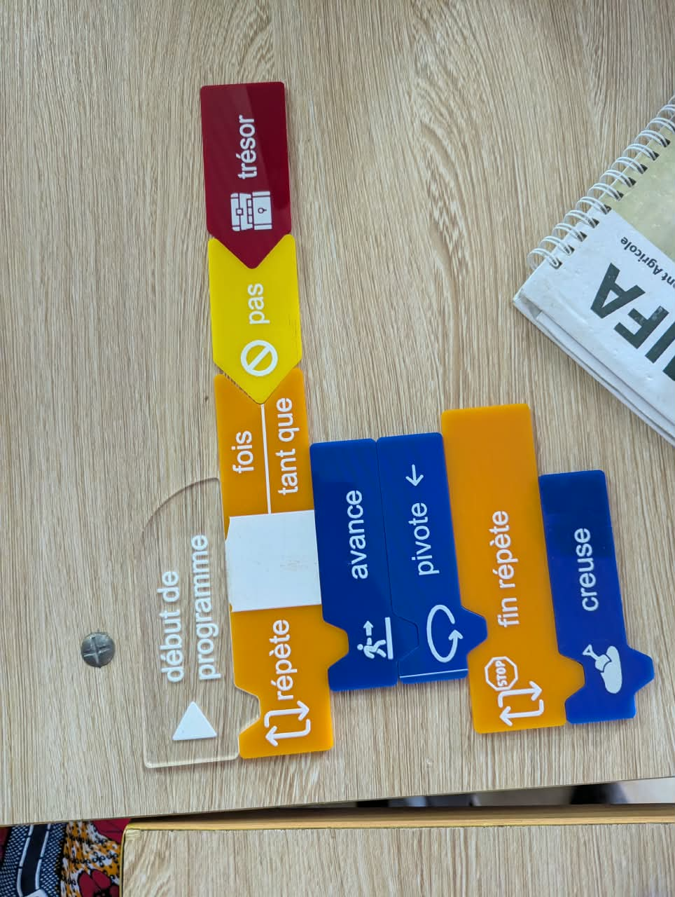
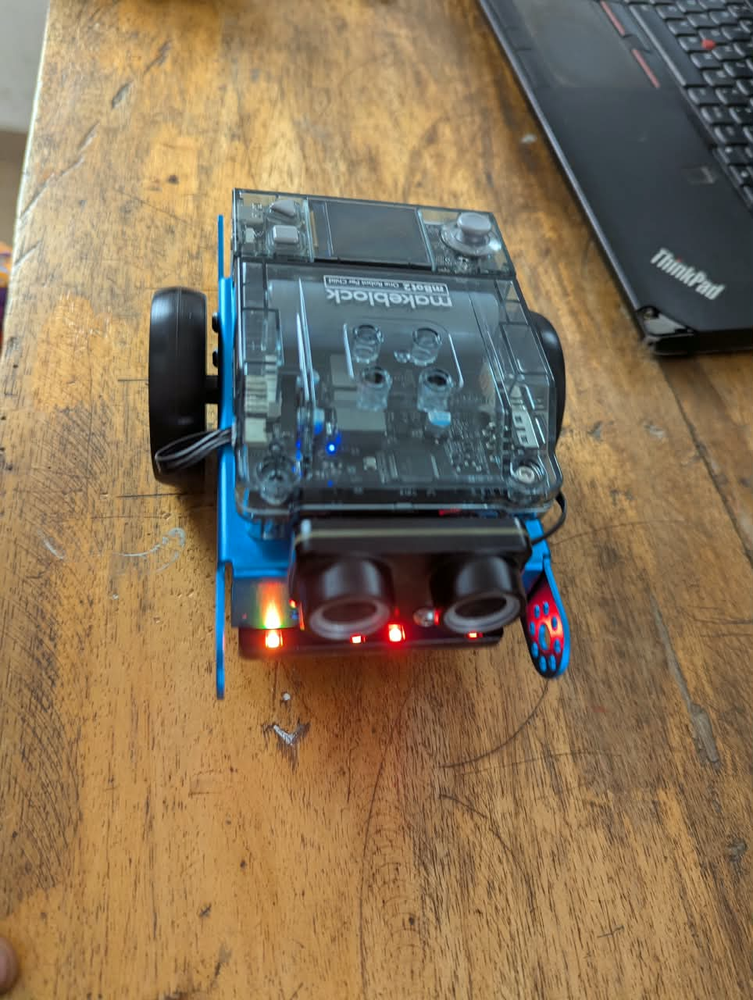
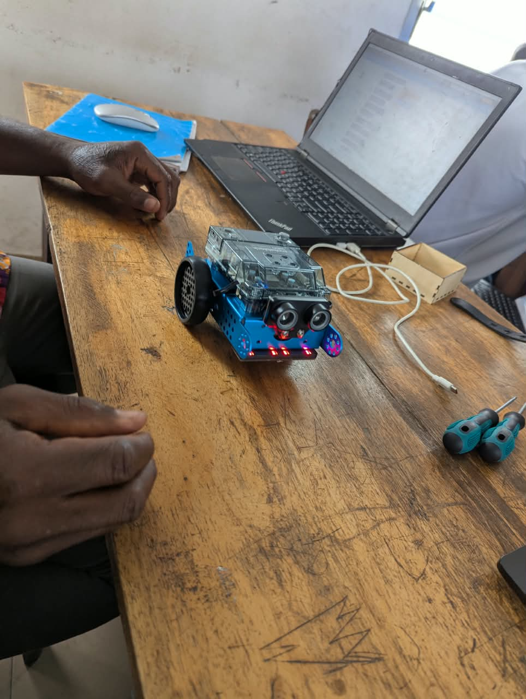

# Journal — mercredi 02 septembre 2026 (rédigé par : Essozolim LEMOU)

## Fait aujourd'hui

### 1. Fondamentaux pour futurs FabManagers : algorithmique

* Introduction aux fondamentaux de l’algorithmique.
* Un **algorithme** est une séquence finie et non ambiguë d’instructions permettant de résoudre un problème donné.
* Découverte de la notion d’**algorithme débranché**, qui permet de travailler sur la logique algorithmique sans utiliser directement un ordinateur.
* Les trois critères retenus pour définir un bon algorithme sont :

  * une suite ordonnée d’instructions ;
  * un nombre fini d’étapes ;
  * des instructions précises permettant de résoudre un problème donné.

### 2. Atelier électronique — Robot voiture avec mBlock

* Montage d’un **robot voiture** à l’aide de l’environnement mBlock.
* Découverte de la programmation du robot.
* Réalisation d’un programme permettant de faire **avancer la voiture**.
* Mise en pratique de la relation entre le montage électronique, la programmation et le mouvement du robot.

### 3. Projet du groupe 2 — P083

* Discussion au sein du groupe sur les **matériels nécessaires** au projet.
* Réflexion sur les différentes possibilités de conception.
* Imagination et recherche d’idées pour préparer le **prototypage final** de la sonnerie autonome à énergie solaire.

## Appris

* Je comprends mieux les caractéristiques fondamentales d’un algorithme : il doit être **ordonné, fini et précis**.
* J’ai découvert le principe de l’**algorithmique débranchée**, qui permet de développer la logique sans dépendre directement d’un ordinateur.
* J’ai appris à réaliser et programmer un **robot voiture avec mBlock** pour obtenir un mouvement d’avancement.
* J’ai compris l’importance de relier la partie **électronique** à la partie **programmation** pour obtenir le comportement souhaité d’un robot.

## Raté, puis corrigé

* Lors des activités pratiques, la mise en œuvre du robot a nécessité de relier correctement le **montage électronique** et le **programme mBlock** afin d’obtenir le déplacement souhaité.
* → **Cause recherchée :** compréhension et mise en pratique du fonctionnement du robot et de sa programmation.
* → **Correction :** reprise du montage et du programme afin de permettre au robot d’avancer.
* → **Résultat :** la voiture robot a pu être programmée pour avancer.

## Décidé

* Poursuivre les recherches sur les matériels nécessaires au projet **P083 — Sonnerie autonome à énergie solaire**.
* Continuer la réflexion sur la conception et le prototypage final du projet.
* Approfondir les compétences en programmation et en algorithmique.

## À faire demain

* Poursuivre la formation en **Python avec Wisdom** .
* Continuer les travaux de conception et de prototypage du projet du groupe 

