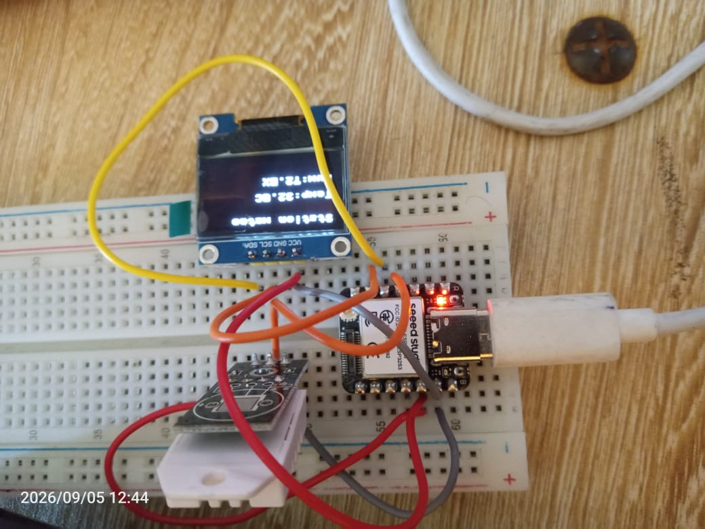

# Journal — samedi 05 septembre 2026 (rédigé par : Essozolim LEMOU)

## Fait aujourd'hui

### 1. Apprentissage à la réalisation d’un projet électronique

* Mise en pratique d’une démarche complète de réalisation d’un petit projet électronique.
* Identification du **matériel nécessaire** :

  * **XIAO ESP32-S3** ;
  * **capteur DHT22** ;
  * **écran OLED** utilisant le protocole de communication **I²C**.
* Réalisation du **schéma de câblage** des différents composants.
* Préparation de l’environnement de programmation avec **Python et Thonny** :

  * installation de Thonny ;
  * configuration de l’environnement ;
  * préparation du programme.
* Téléversement du programme vers la carte **XIAO ESP32-S3**.
* Exécution du programme à partir de la commande **Run** dans Thonny.
* Mise en œuvre pratique de la communication entre la carte, le capteur DHT22 et l’écran OLED.

## Appris

* J’ai appris à identifier les composants nécessaires avant de commencer la réalisation d’un projet électronique.
* J’ai compris le rôle du **DHT22** dans la mesure des paramètres environnementaux.
* J’ai découvert l’utilisation d’un **écran OLED avec une communication I²C**.
* J’ai appris à préparer et configurer **Thonny** pour programmer une carte électronique.
* J’ai compris les différentes étapes entre le **câblage, la programmation, le téléversement et l’exécution** d’un programme.

## Raté, puis corrigé

* La réalisation du projet a nécessité de vérifier la correspondance entre le **schéma de câblage** et le programme utilisé.
* → **Cause :** mise en pratique de l’ensemble des étapes d’un projet électronique avec plusieurs composants.
* → **Correction :** vérification du câblage, de la configuration de Thonny et du programme avant son exécution.
* → **Résultat :** réalisation du projet électronique avec la XIAO ESP32-S3, le DHT22 et l’écran OLED.

## Décidé

* Continuer à pratiquer la programmation Python appliquée aux systèmes électroniques.
* Approfondir l’utilisation de la **XIAO ESP32-S3**, des capteurs et des écrans I²C.
* Utiliser les compétences acquises dans les futurs travaux de prototypage du projet **P083 — Sonnerie autonome à énergie solaire**.

## À faire demain

* Revoir les notions de programmation Python étudiées.
* Poursuivre les travaux pratiques d’électronique et de prototypage.
* Continuer la préparation technique du projet **P083 — Sonnerie autonome à énergie solaire**.
