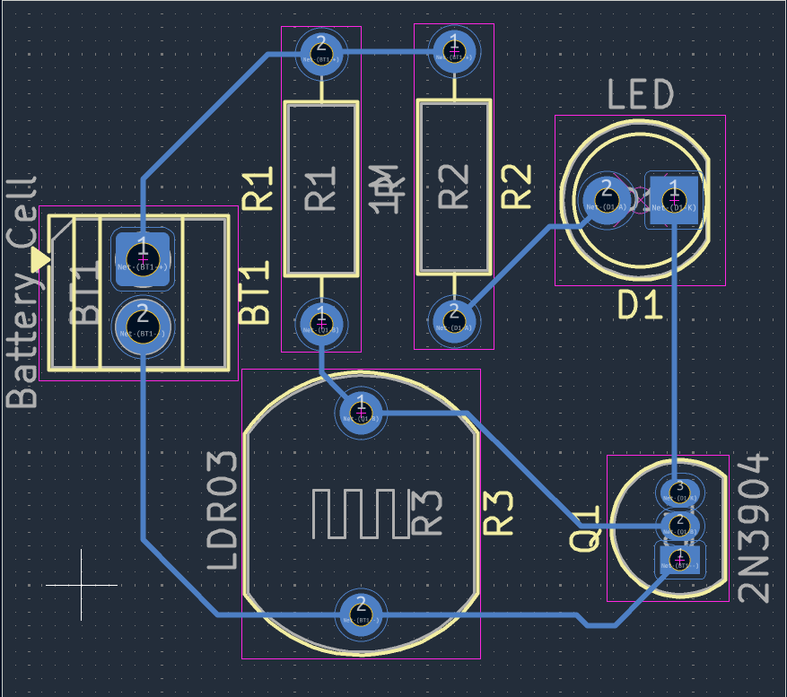

# Journal — lundi 07 septembre 2026 (rédigé par : Essozolim LEMOU)

## Fait aujourd'hui

### 1. Conception électronique avec KiCad — Cours d’initiation aux PCB

**Cours présenté par Arnauld Kpadenu.**

#### Comprendre le PCB

* Un **PCB (Printed Circuit Board)** est une carte électronique qui sert à **supporter, connecter et organiser les composants électroniques**.
* La **breadboard** sert principalement à expérimenter et à tester un circuit.
* Le **PCB** permet ensuite de transformer cette expérimentation en une carte électronique réelle et plus durable.

#### Pourquoi passer du prototypage au PCB ?

Les limites du prototypage sur breadboard sont notamment :

* câblage volumineux et fragile ;
* connexions moins fiables ;
* sensibilité aux vibrations ;
* difficulté à reproduire exactement le même montage.

Le passage au PCB permet :

* une réduction de la taille et du câblage ;
* des connexions plus solides et répétables ;
* une meilleure résistance aux vibrations ;
* une fabrication duplicable.

#### Anatomie d’un PCB

* Présentation de l’anatomie d’un PCB et de ses **7 éléments principaux**.

#### De l’idée au schéma électronique

Les principales étapes étudiées sont :

1. Définir clairement ce que le circuit doit faire.
2. Choisir les composants adaptés.
3. Réaliser le **schéma électronique** avant de concevoir la carte.
4. Associer chaque composant électronique à son **footprint**.
5. Définir les contraintes du projet :

   * alimentation ;
   * dimensions ;
   * courant ;
   * connecteurs ;
   * environnement d’utilisation.

#### Exercices

* **Exercice à réaliser à la maison :** établir une liste de composants électroniques avec leur **symbole électrique** et leur nom.
* **Exercice pratique sur KiCad :** conception du schéma d’un **interrupteur crépusculaire**.
* Les composants utilisés sont :

  * une LED ;
  * un transistor ;
  * une photorésistance ;
  * une résistance de **220 Ω** ;
  * une résistance de **1 MΩ**.

### 2. Travail sur le projet du groupe 2

* Poursuite des réflexions techniques concernant le projet **P083 — Sonnerie autonome à énergie solaire**.
* Discussion sur les besoins en composants et sur les possibilités de conception de la carte électronique du projet.

## Appris

* J’ai compris le rôle d’un **PCB** dans la réalisation d’un système électronique.
* J’ai compris la différence entre une **breadboard**, utilisée pour expérimenter, et un **PCB**, destiné à réaliser une carte électronique plus stable et reproductible.
* J’ai découvert les principales raisons qui justifient le passage du prototypage à une carte PCB.
* J’ai appris les premières étapes de conception d’un circuit avec **KiCad**, depuis la définition du besoin jusqu’au choix des composants et des footprints.
* J’ai appris à réaliser un premier schéma électronique sur KiCad avec l’exemple de l’**interrupteur crépusculaire**.

## Raté, puis corrigé

* La conception d’un circuit sur KiCad nécessite de respecter une démarche organisée avant de passer à la réalisation de la carte.
* → **Cause :** découverte du processus de conception d’un PCB et de l’association entre les composants, leurs symboles et leurs footprints.
* → **Correction :** reprise des différentes étapes : définition du fonctionnement, choix des composants et réalisation du schéma électronique.
* → **Résultat :** réalisation de l’exercice de schéma d’un interrupteur crépusculaire sur KiCad.

## Décidé

* Poursuivre la maîtrise de **KiCad** afin de pouvoir concevoir progressivement des cartes électroniques adaptées aux projets.
* Réaliser l’exercice à domicile sur les **symboles et les noms des composants électroniques**.
* Étudier la possibilité d’intégrer une conception PCB dans le projet **P083 — Sonnerie autonome à énergie solaire**.

## À faire demain

* Poursuivre la formation et les exercices de conception électronique.
* Continuer les travaux du projet **P083**.
* Revoir les notions de **PCB, schéma électronique, composants et footprints**.
