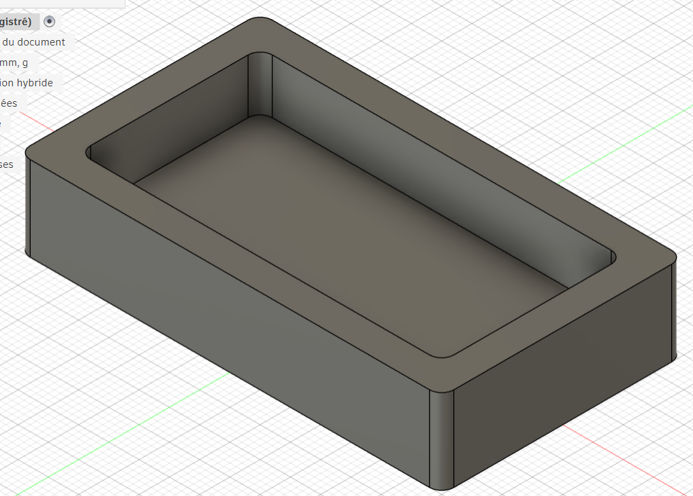

# Journal — mardi 08 septembre 2026 (rédigé par : Essozolim LEMOU)

## Fait aujourd'hui

### 1. Fabrication assistée par ordinateur : de la conception à la pièce usinée avec Fusion 360

**Cours présenté par : Sitou**

La séance a porté sur la **fabrication assistée par ordinateur (FAO/CAM)** et sur le processus permettant de passer de la conception numérique à la fabrication d'une pièce sur une machine CNC.

Les principaux points abordés sont :

* Qu'est-ce que la FAO (CAM) ?
* Les machines CNC : de quoi parle-t-on ?
* **Fusion 360** comme environnement intégré regroupant notamment la conception (*Design*) et la fabrication (*Manufacturing*).
* Les différentes stratégies d'usinage :

  * ébauche ;
  * finition.
* Les principaux paramètres de coupe :

  * vitesse de coupe ;
  * vitesse d'avance ;
  * profondeur de passe ;
  * engagement radial.
* La **simulation d'usinage**, permettant de vérifier les opérations avant de lancer l'usinage réel.
* Le **post-traitement**, qui permet de générer le fichier **G-code** adapté à la machine CNC.
* L'intérêt de la FAO dans Fusion 360 pour préparer, simuler et contrôler les opérations d'usinage.
* Les bonnes pratiques à retenir :

  * toujours simuler avant l'usinage réel ;
  * adapter les paramètres d'usinage au matériau et à l'outil ;
  * vérifier les dimensions et les trajectoires avant l'usinage.

**Exemple pratique avec Fusion 360**

Nous avons également réalisé une démonstration pratique consistant à :

* préparer une opération d'usinage dans Fusion 360 ;
* définir les paramètres de fabrication ;
* générer un **G-code** ;
* utiliser le logiciel **Candle** pour communiquer avec la machine CNC et contrôler l'exécution du programme.

### 2. Travail sur le projet du groupe 2

La deuxième partie de la journée a été consacrée à l'avancement du projet du **groupe 2**.

Les travaux réalisés ont principalement porté sur :

* le **prototypage de la boîte** du dispositif ;
* le **prototypage du circuit électronique** ;
* la réflexion sur l'intégration des différents composants dans le boîtier ;
* la préparation des éléments nécessaires pour passer progressivement de la conception au prototype fonctionnel.

## Appris

* J'ai compris le rôle de la **FAO** dans le processus de fabrication numérique.
* J'ai appris les principales étapes permettant de passer d'un modèle 3D à une pièce usinée.
* J'ai découvert l'importance des paramètres de coupe, notamment la vitesse d'avance et la profondeur de passe.
* J'ai compris l'utilité de la **simulation dans Fusion 360** pour détecter les éventuelles erreurs avant l'usinage.
* J'ai appris qu'après la préparation des opérations d'usinage, il faut utiliser le **post-traitement pour générer le G-code** adapté à la machine.
* J'ai découvert l'utilisation de **Candle** pour le contrôle et l'exécution du G-code sur une machine CNC.
* Dans le cadre du projet du groupe 2, j'ai également compris l'importance de concevoir simultanément le **boîtier et le circuit électronique** afin de garantir leur compatibilité.

## Raté, puis corrigé

Lors de la préparation du projet, certaines difficultés sont apparues concernant la conception du boîtier et l'organisation des différents composants électroniques.

Nous avons corrigé ces difficultés en réfléchissant davantage à la disposition des composants et à leur intégration dans la boîte. Cette étape nous a permis de mieux comprendre l'importance de vérifier les dimensions et l'encombrement des composants avant la fabrication.

Concernant l'usinage CNC, la simulation permet également de corriger les erreurs de trajectoire ou de paramètres avant de lancer la fabrication réelle.

## Décidé

* Poursuivre le **prototypage de la boîte** du projet.
* Continuer la conception et le prototypage du **circuit électronique**.
* Vérifier les dimensions des composants avant la fabrication du boîtier.
* Utiliser systématiquement la simulation avant toute opération d'usinage CNC.
* Améliorer progressivement l'intégration mécanique et électronique du prototype.

# À faire demain

* Continuer le prototypage de la boîte.
* Poursuivre le prototypage du circuit électronique.
* Vérifier l'intégration des composants dans le boîtier.
* Tester progressivement le fonctionnement des différents éléments du circuit.
* Poursuivre la préparation du prototype fonctionnel du projet.
