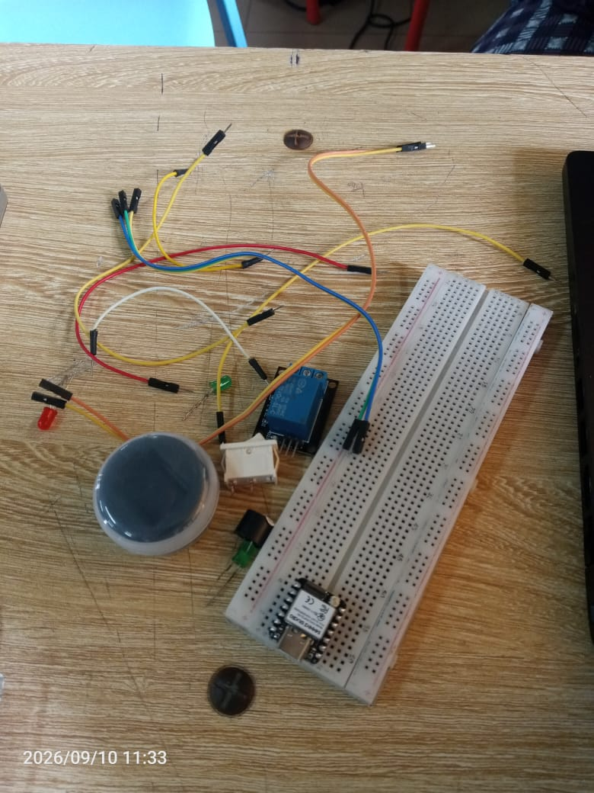

# Journal — jeudi 10 septembre 2026 (rédigé par : Essozolim LEMOU)

## Fait aujourd'hui

### 1. Travail en groupe

**Idée générale du fonctionnement du XIAO ESP32-S3 et du DS3231 dans le projet**

* Le système est centré autour du **DS3231**, qui communique avec le XIAO ESP32-S3 à travers le protocole **I²C**.
* Le **XIAO ESP32-S3** récupère l'heure en temps réel depuis le DS3231 et effectue des comparaisons avec les horaires de sonnerie programmés.
* Le système doit lire régulièrement l'heure et la comparer aux horaires enregistrés afin de déclencher automatiquement la sonnerie.

### 2. Réception du matériel

**Matériels reçus le 10/09/2026 :**

* Plaquette SK10
* XIAO ESP32-S3
* 3 LED : une rouge et deux vertes
* Interrupteur ON/OFF
* Buzzer
* Un module relais




### 3. Réalisation du premier prototype du boîtier

Un premier prototype du boîtier a été réalisé afin de vérifier l'intégration physique des différents éléments.

**Erreurs et difficultés constatées sur le premier prototype :**

* Absence des trous nécessaires pour l'interrupteur et les LED ;
* Largeur effective du boîtier à revoir ;
* Difficultés liées à l'emplacement et à la lisibilité des repères des broches du PCB ;
* Absence d'un trou permettant la sortie du câble du panneau solaire.


### 4. Test de récupération de l'heure avec le XIAO ESP32-S3 et le DS3231

Un test a été réalisé afin de vérifier la communication entre le **XIAO ESP32-S3** et le **DS3231** et de récupérer l'heure en temps réel pour l'afficher sur le moniteur série de Thonny.

**Dispositif réalisé :**


**Code utilisé avec MicroPython :**

```python
from machine import Pin, I2C
from ds3231 import DS3231
import time


# ==========================
# I2C XIAO ESP32-S3
# ==========================

i2c = I2C(
    0,
    scl=Pin(6),   # D5
    sda=Pin(5),   # D4
    freq=100000
)

print("==============================")
print("  XIAO ESP32-S3 + DS3231")
print("==============================")


# Vérification I2C
print("Peripheriques I2C :", i2c.scan())


# Création du RTC
rtc = DS3231(i2c)

print("DS3231 detecte !")
print("------------------------------")


# ==========================
# Lecture permanente
# ==========================

while True:

    year, month, day, hour, minute, second, weekday = rtc.datetime()

    print(
        "Date : {:02d}/{:02d}/{}   Heure : {:02d}:{:02d}:{:02d}".format(
            day,
            month,
            year,
            hour,
            minute,
            second
        )
    )

    time.sleep(1)
```

**Résultats obtenus :**

```text
MPY: soft reboot
==============================
  XIAO ESP32-S3 + DS3231
==============================
Peripheriques I2C : [87, 104]
DS3231 detecte !
------------------------------
Date : 10/09/2026   Heure : 15:59:44
Date : 10/09/2026   Heure : 15:59:45
Date : 10/09/2026   Heure : 15:59:46
Date : 10/09/2026   Heure : 15:59:47
Date : 10/09/2026   Heure : 15:59:48
...
Date : 10/09/2026   Heure : 15:59:59
Date : 10/09/2026   Heure : 16:00:00
```

Le test a confirmé que le XIAO ESP32-S3 communique correctement avec le DS3231 et que l'heure est récupérée et actualisée chaque seconde.

## Appris

* J'ai appris à utiliser le protocole **I²C** pour établir une communication entre le XIAO ESP32-S3 et le DS3231.
* J'ai appris à identifier les périphériques connectés au bus I²C grâce à la fonction `i2c.scan()`.
* J'ai compris que l'adresse **0x68** correspond au DS3231.
* J'ai appris à utiliser un pilote MicroPython (`ds3231.py`) pour communiquer avec le module RTC.
* J'ai appris à récupérer séparément l'année, le mois, le jour, l'heure, les minutes et les secondes.
* J'ai compris que le DS3231 permet de conserver une référence temporelle indépendante du fonctionnement permanent du programme principal.
* J'ai également appris l'importance de vérifier les dimensions et les emplacements des ouvertures lors de la conception d'un boîtier.

## Raté, puis corrigé

Lors de la réalisation du premier prototype du boîtier, plusieurs erreurs de conception ont été constatées : les ouvertures pour l'interrupteur et les LED n'étaient pas prévues, la largeur du boîtier devait être ajustée et la sortie destinée au panneau solaire n'avait pas été prévue.

Ces erreurs ont permis d'identifier les modifications nécessaires avant la fabrication du prochain prototype.

Concernant la partie électronique, le test de communication I²C a finalement permis de confirmer le bon fonctionnement du XIAO ESP32-S3 et du DS3231 après avoir identifié correctement les broches utilisées :

* **D4 / GPIO5 → SDA**
* **D5 / GPIO6 → SCL**

## Décidé

* Utiliser le **XIAO ESP32-S3** comme contrôleur principal du système.
* Utiliser le **DS3231** comme référence temporelle pour la programmation des sonneries.
* Utiliser **MicroPython** pour le développement du programme.
* Poursuivre les tests avec une fonction permettant de comparer l'heure actuelle aux horaires programmés.
* Améliorer le prochain prototype du boîtier en tenant compte des erreurs constatées sur le premier modèle.

# À faire demain

* Tester la fonction de déclenchement automatique de la sonnerie à partir d'un horaire programmé.
* Tester la commande du buzzer et/ou du relais à partir du XIAO ESP32-S3.
* Corriger les dimensions et les ouvertures du boîtier.
* Poursuivre l'intégration des différents composants dans le prototype.
* Commencer à réfléchir à la gestion de plusieurs horaires de sonnerie.
