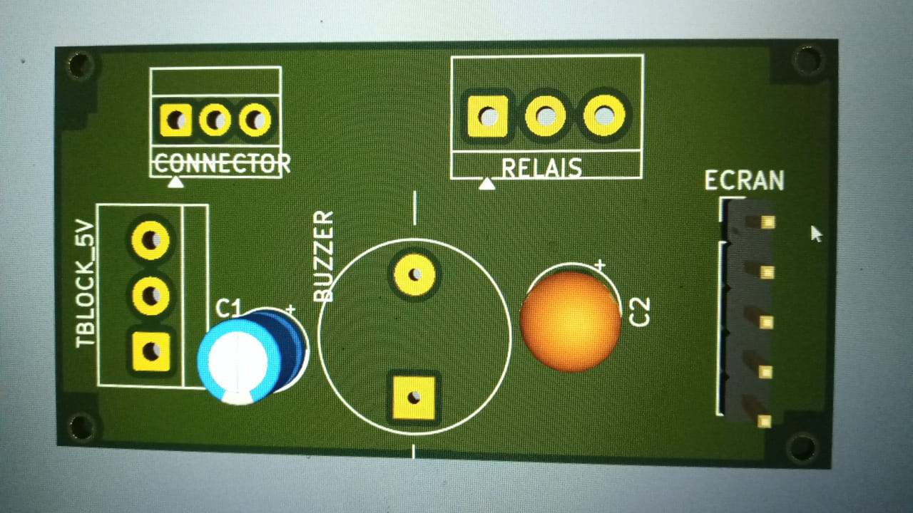
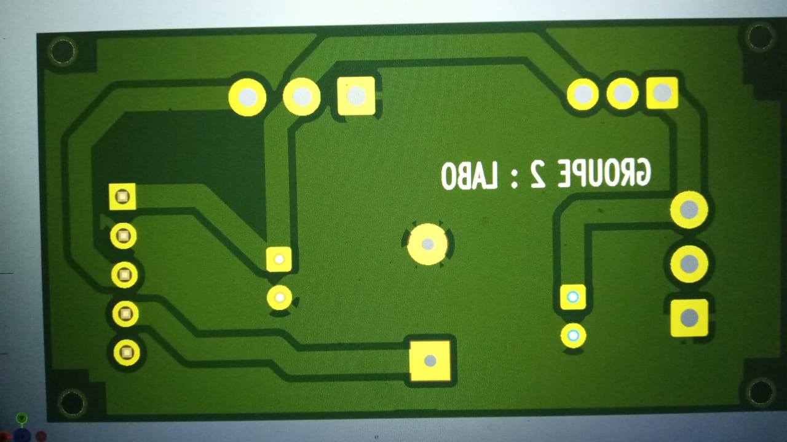

# Journal — lundi 14 septembre 2026 (rédigé par : Essozolim LEMOU)

## Fait aujourd'hui

### 1. Travail en groupe — Conception du boîtier avec Fusion 360

* Travail en groupe sur la conception et l’amélioration du **boîtier du Smart Auto Bell** avec **Fusion 360**.
* **Impression du prototype du couvercle** du boîtier afin de vérifier sa conception.
* Restructuration de l’organisation des **composants à l’intérieur du boîtier**.
* Réaménagement de la disposition des composants sur le **PCB** afin d’améliorer leur organisation.
* Réaménagement de la présentation et de la conception du **couvercle**.
* Reconception du **boîtier** en fonction des différentes contraintes constatées lors du prototypage.

### 2. Réalisation du PCB avec KiCad

#### 2.1 Réalisation du circuit avec l’éditeur schématique

* Poursuite de la conception du circuit électronique avec **KiCad**.
* Réalisation du schéma électronique à l’aide de l’**éditeur schématique**.
* Préparation du circuit avant son passage à la conception physique du PCB.

[Pistes du PCB](2026-09-14.md)

#### 2.2 Réalisation du PCB

* Passage de la conception schématique à la réalisation de la carte électronique.
* Organisation et réalisation des **pistes du PCB**.
* Vérification visuelle de la carte réalisée.

## Appris

* J’ai appris à utiliser **Fusion 360** pour adapter un boîtier à l’organisation réelle des composants.
* J’ai compris l’importance de réaliser un **prototype du couvercle** avant de finaliser le boîtier.
* J’ai appris qu’une modification de la disposition des composants internes peut entraîner une **reconception du boîtier**.
* J’ai renforcé ma maîtrise de **KiCad**, notamment pour passer du schéma électronique à la conception du PCB.
* J’ai compris l’importance de bien organiser les composants et les pistes avant la réalisation définitive de la carte.

## Raté, puis corrigé

* Le premier travail de conception du boîtier a nécessité plusieurs réaménagements.
* → **Cause :** l’organisation des composants internes et leur disposition sur le PCB nécessitaient des adaptations.
* → **Correction :** restructuration de l’organisation interne, réaménagement du PCB, modification du couvercle et reconception du boîtier.
* → **Résultat :** un nouveau travail de conception du boîtier a été réalisé afin de mieux correspondre à l’organisation des composants.

## Décidé

* Poursuivre l’amélioration du **boîtier du Smart Auto Bell** à partir des résultats du prototype.
* Maintenir une bonne organisation des composants sur le PCB avant la fabrication finale.
* Continuer la conception et la vérification du PCB avec **KiCad**.
* Vérifier la compatibilité entre le **boîtier, le PCB et les composants internes** avant la réalisation finale.

## À faire demain

* Poursuivre la conception et l’amélioration du **boîtier avec Fusion 360**.
* Continuer la vérification du **PCB conçu avec KiCad**.
* Vérifier l’intégration du PCB et des composants dans le boîtier.
* Poursuivre le prototypage du **Smart Auto Bell — P083**.
