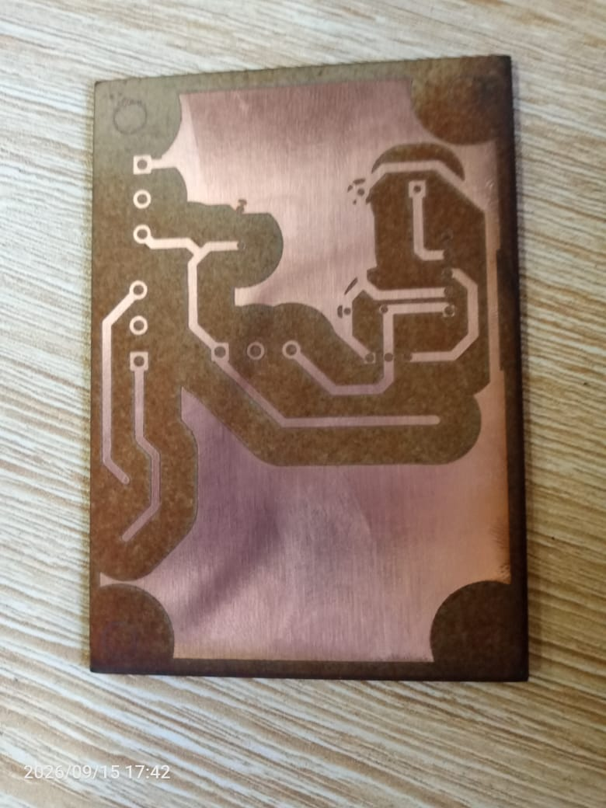

# Journal — mardi 15 septembre 2026 (rédigé par : Essozolim LEMOU)

## Fait aujourd’hui

### 1. Réception de nouveaux matériels

* Réception de nouveaux composants destinés à la réalisation du projet :

  * **Convertisseur HI-LINK** ;
  * **Condensateur**.

* L’intégration de ces nouveaux composants dans la conception a entraîné :

  * une **modification du PCB** ;
  * une **modification du boîtier**.

### 2. Travail en groupe — Conception du boîtier avec Fusion 360

* Modification des **dimensions du boîtier** afin de prendre en compte les nouveaux composants.
* Travail en groupe sur la conception et l’amélioration du **boîtier du Smart Auto Bell** avec **Fusion 360**.
* **Impression du prototype du couvercle** du boîtier afin de vérifier sa conception.
* Restructuration de l’organisation des **composants à l’intérieur du boîtier**.
* Réaménagement de la disposition des composants sur le **PCB** afin d’améliorer leur organisation.
* Réaménagement de la présentation et de la conception du **couvercle**.
* Reconception du **boîtier** en fonction des contraintes liées à l’intégration des composants.

### 3. Réalisation du premier PCB avec KiCad

#### 3.1 Réalisation du circuit avec l’éditeur schématique

* Poursuite de la conception du premier PCB avec **KiCad**.
* Téléchargement du **footprint du module HI-LINK**.
* Intégration du footprint dans le projet KiCad.
* Ajout des composants nécessaires au schéma électronique.
* Réalisation des différentes **connexions électriques** entre les composants.

#### 3.2 Réalisation du PCB

* Passage de la conception schématique à la conception physique de la carte.
* Organisation des composants sur le PCB.
* Réalisation et organisation des **pistes du PCB**.
* Ajout du **plan de masse**.
* Vérification visuelle de la carte avant son impression.

#### 3.3 Impression du premier PCB

* Impression du **premier PCB** réalisé avec KiCad.

* Après l’impression, nous avons constaté que **certaines pastilles n’étaient pas correctement réalisées**.
* Le **plan de masse** avait également été intégré à la conception et devait être pris en compte lors de l’analyse du résultat obtenu.

## Appris

* J’ai appris qu’un changement de composant peut entraîner des modifications à la fois du **PCB et du boîtier**.
* J’ai renforcé ma maîtrise de **KiCad**, notamment dans le passage du schéma électronique à la conception physique du PCB.
* J’ai appris à rechercher et intégrer le **footprint d’un composant**, notamment celui du module HI-LINK.
* J’ai compris l’importance de vérifier les **connexions, les pistes, les pastilles et le plan de masse** avant l’impression du PCB.
* J’ai compris que la première fabrication d’un PCB permet de détecter des problèmes qui ne sont pas forcément visibles uniquement dans la conception informatique.

## Raté, puis corrigé

* Après l’impression du premier PCB, certaines **pastilles n’ont pas été correctement réalisées**.
* **Cause :** problème constaté lors du passage de la conception numérique à la fabrication physique du PCB.
* **Correction envisagée :** analyser la conception du PCB, notamment les pastilles, les pistes et le plan de masse, afin d’identifier les éléments à modifier avant une nouvelle impression.
* **Résultat :** le premier prototype a permis d’identifier plusieurs points à corriger sur la carte avant une nouvelle fabrication.

## Décidé

* Modifier le **PCB** en tenant compte des problèmes constatés sur le premier prototype.
* Vérifier attentivement les **pastilles, les pistes et le plan de masse** avant la prochaine impression.
* Adapter également les dimensions et l’organisation du **boîtier** en fonction des composants réellement utilisés.
* Continuer à utiliser uniquement les composants effectivement disponibles pour finaliser la conception du **Smart Auto Bell — P083**.

## À faire demain

* Corriger le **PCB dans KiCad** à partir des problèmes constatés sur le premier prototype.
* **Retirer le plan de masse** afin de faciliter la prochaine fabrication.
* **Ajuster les dimensions des pastilles** pour améliorer leur réalisation lors de l’impression.
* Vérifier les **pistes et les connexions électriques**.
* Effectuer une nouvelle vérification générale du PCB avant fabrication.
* Poursuivre les modifications du **boîtier avec Fusion 360**.
* Réaliser une **nouvelle impression du PCB** après les corrections.
