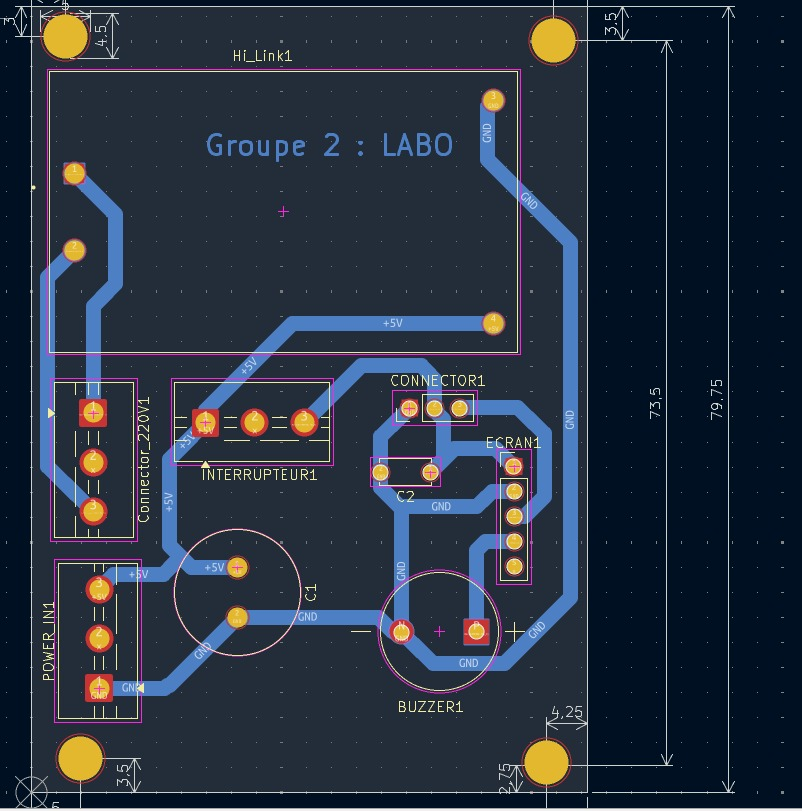
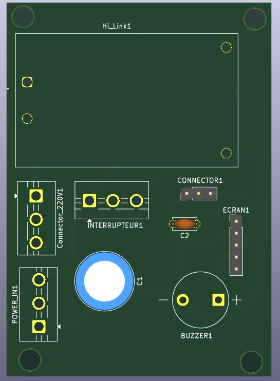
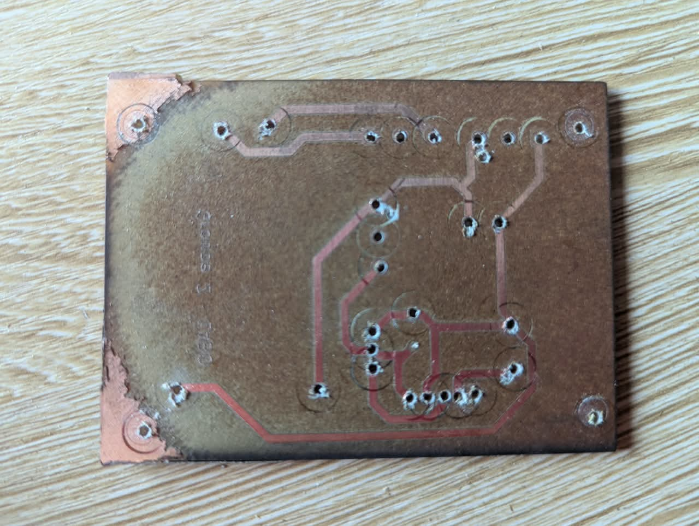
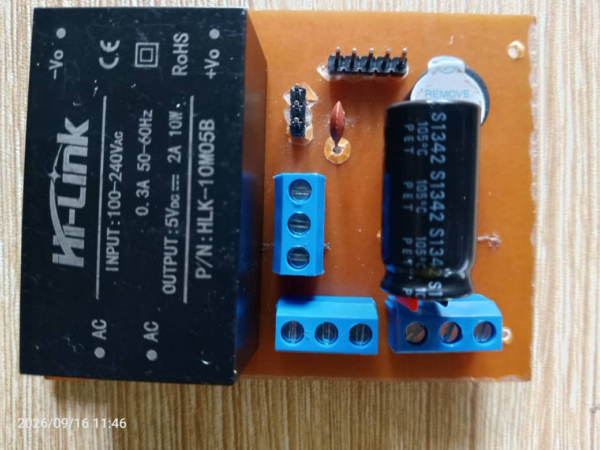
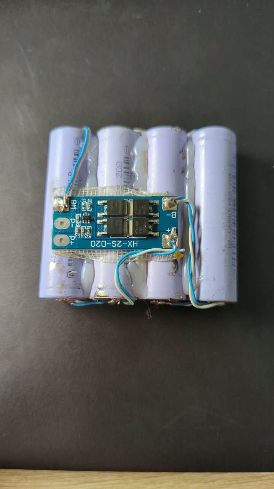

# Journal — mercredi 16 septembre 2026 (rédigé par : Essozolim LEMOU)

## Fait aujourd'hui

### 1. Correction et réalisation du PCB

* Reprise de la conception du **circuit imprimé (PCB)** à la suite des défauts constatés lors de la réalisation du premier prototype.
* Correction et réorganisation du routage afin d’obtenir une meilleure disposition des différentes **pistes électriques**, des pastilles de soudure et des connexions entre les composants.
* Réalisation du routage des pistes du PCB en tenant compte de l’organisation générale de la carte et de l’implantation des composants.

* Vérification du **modèle 3D du PCB** afin de contrôler visuellement l’implantation des composants, leur positionnement et la cohérence générale de la carte avant fabrication.

* Après validation de la nouvelle conception, impression du **PCB corrigé** en vue de son assemblage.

### 2. Fabrication et assemblage de la carte électronique

* Réalisation du PCB physique à partir de la conception corrigée.
* **Perçage des différents trous** nécessaires à l’implantation des composants traversants.

* Préparation et implantation des différents **composants électroniques** sur la carte.
* Réalisation des opérations de **soudure** afin d’assurer les connexions électriques et la fixation mécanique des composants.
* Contrôle visuel de la carte après soudure afin de vérifier l’état général des connexions et de l’assemblage.
* Finalisation de la carte électronique destinée aux essais du projet.

* Obtention d’une **carte électronique assemblée**, prête pour les premiers essais électriques et fonctionnels sur table.

### 3. Réalisation du système de stockage d’énergie à base de cellules lithium

* Utilisation de **4 cellules lithium de 2600 mAh chacune** pour constituer le système de stockage d’énergie.
* Association des cellules **deux à deux en parallèle (2P)** afin d’augmenter la capacité disponible de chaque groupe.
* Mise en série des deux groupes parallèles afin d’augmenter la tension globale du pack.
* Cette configuration correspond à une architecture **2S2P** : deux groupes en série, chaque groupe étant constitué de deux cellules en parallèle.
* Raccordement du pack au **BMS S2**, adapté à une configuration comportant deux groupes de cellules en série.
* Le BMS assure notamment la gestion de la charge et la protection du pack dans le cadre de son utilisation avec le système électronique.

### 4. Réalisation d'un test sur table

* Mise en place d’un premier **test électrique sur table** afin de vérifier le comportement des différents éléments avant leur intégration dans le boîtier.
* Obtention d’une tension de **5 V** à partir d’un module de conversion destiné à l’alimentation des éléments électroniques.
* Utilisation de cette alimentation pour mettre sous tension le **PCB**, notamment la partie associée à l’écran.
* Alimentation de la carte **CYD** à travers le PCB afin de vérifier la distribution de l’énergie.
* Connexion du **module RTC DS3231** à la carte CYD pour poursuivre les essais liés à la gestion de l’heure du système.
* Réalisation d’un premier essai de fonctionnement de l’ensemble sur table.

## Appris

* J’ai appris à effectuer une **correction de PCB à partir des défauts observés sur un premier prototype**, en améliorant progressivement la conception avant une nouvelle fabrication.
* J’ai compris l’importance du **routage des pistes** dans la conception d’un circuit imprimé, notamment pour assurer des connexions électriques cohérentes et une organisation propre de la carte.
* J’ai compris l’intérêt de la **vérification du modèle 3D dans KiCad** avant la fabrication physique, car elle permet de contrôler l’implantation générale des composants et de détecter certaines incohérences.
* J’ai approfondi les différentes étapes de fabrication d’un PCB : **impression, transfert/réalisation, perçage, implantation, soudure et contrôle de la carte assemblée**.
* J’ai appris à constituer un pack de batteries en combinant les cellules **en parallèle pour augmenter la capacité**, puis **en série pour augmenter la tension disponible**.
* J’ai compris le principe d’une configuration **2S2P**, utilisée ici pour organiser les quatre cellules lithium en deux groupes parallèles connectés en série.
* J’ai également compris l’importance du **BMS** dans la gestion et la protection d’un pack de batteries lithium.
* Enfin, j’ai appris l’intérêt de réaliser un **test sur table avant l’intégration définitive**, afin de vérifier progressivement l’alimentation et le fonctionnement des différents sous-systèmes.

## Raté, puis corrigé

* Lors du premier essai, la **carte CYD ne démarrait pas correctement sur la batterie** lorsque le convertisseur **XL4015** était raccordé à l’entrée **Vin**.
* → **Constat :** la configuration d’alimentation utilisant le XL4015 ne permettait pas d’obtenir le démarrage attendu de la carte CYD dans les conditions du test.
* → **Action corrective :** remplacement du convertisseur XL4015 par un **module de charge et d’élévation de tension 5 V / 2 A avec connecteur USB Type-C**, adapté à l’essai d’alimentation de la carte.
* → **Vérification :** après remplacement du module, la carte CYD a démarré et l’ESP a fonctionné correctement lors du test sur table.
* Cette étape a permis de confirmer l’importance de **valider la chaîne d’alimentation avant de poursuivre l’intégration des autres fonctions électroniques**.

## Décidé

* Retenir, pour les essais actuels de la carte CYD, la nouvelle solution de conversion **5 V / 2 A avec interface USB Type-C**.
* Poursuivre les validations électriques **sur table**, avant de procéder à l’intégration définitive des éléments dans le boîtier.
* Vérifier progressivement la distribution de l’alimentation entre le **pack batterie, le PCB, l’écran et la carte CYD**.
* Poursuivre l’intégration et les essais du **DS3231** afin de valider la fonction de gestion de l’heure du système.
* Continuer à corriger et à améliorer la conception matérielle du projet **P083 — Sonnerie autonome à énergie solaire** à partir des résultats obtenus lors des essais.

## À faire demain

* Poursuivre les **tests électriques et fonctionnels sur table**.
* Vérifier le comportement de la carte électronique assemblée lorsqu’elle est alimentée par le **pack batterie 2S2P**.
* Contrôler la stabilité de l’alimentation **5 V** destinée aux éléments électroniques.
* Continuer les essais de communication entre la **carte CYD et le DS3231**.
* Vérifier progressivement le fonctionnement de l’écran et des autres éléments raccordés au PCB.
* Poursuivre l’intégration matérielle et fonctionnelle des différents sous-systèmes du projet **P083 — Sonnerie autonome à énergie solaire**.
